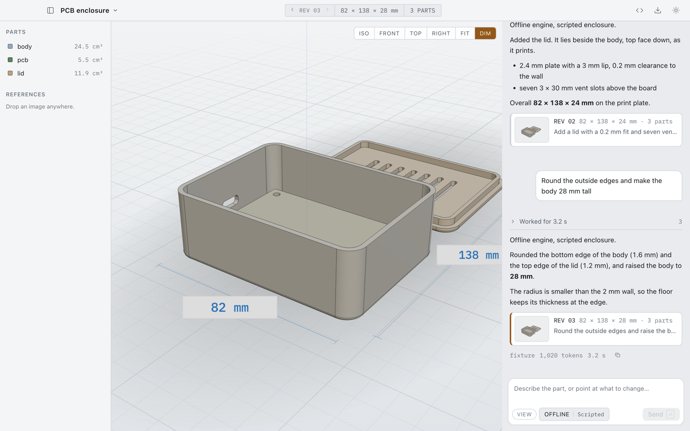
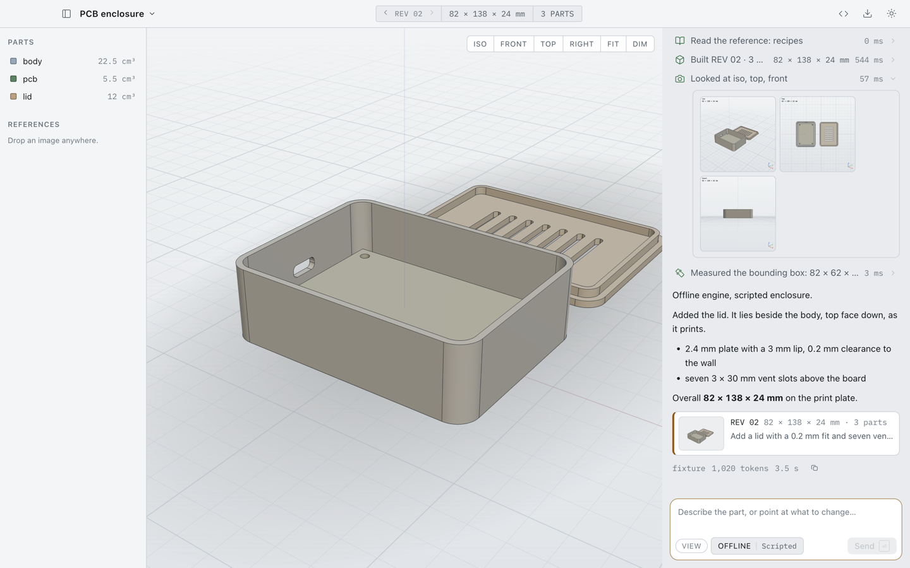
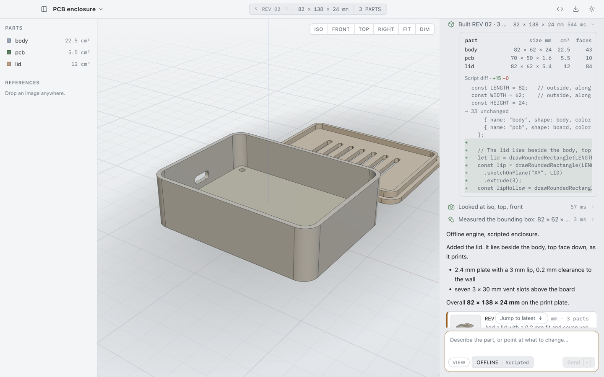
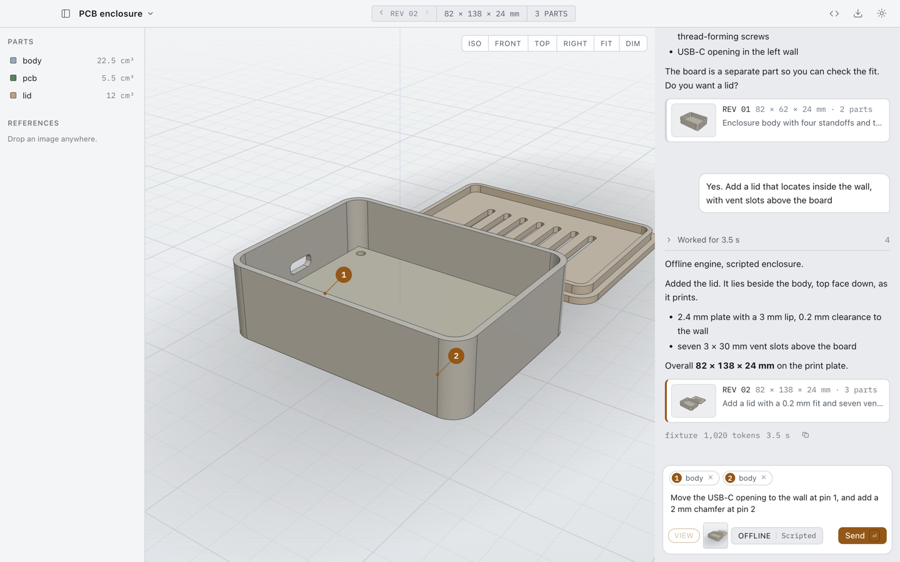
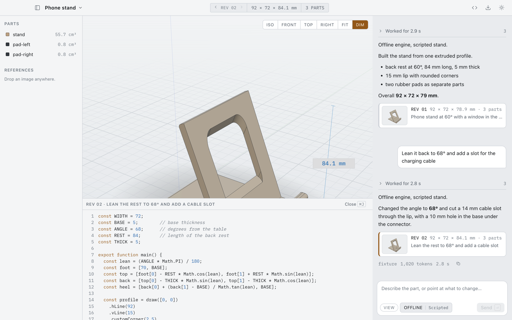
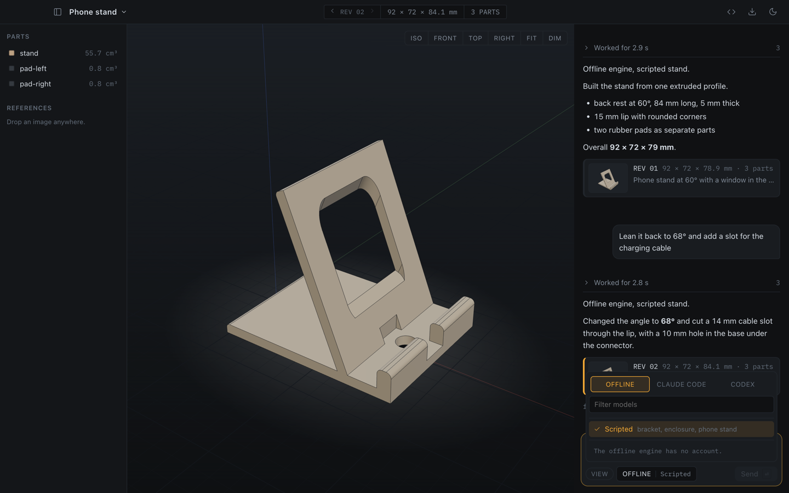
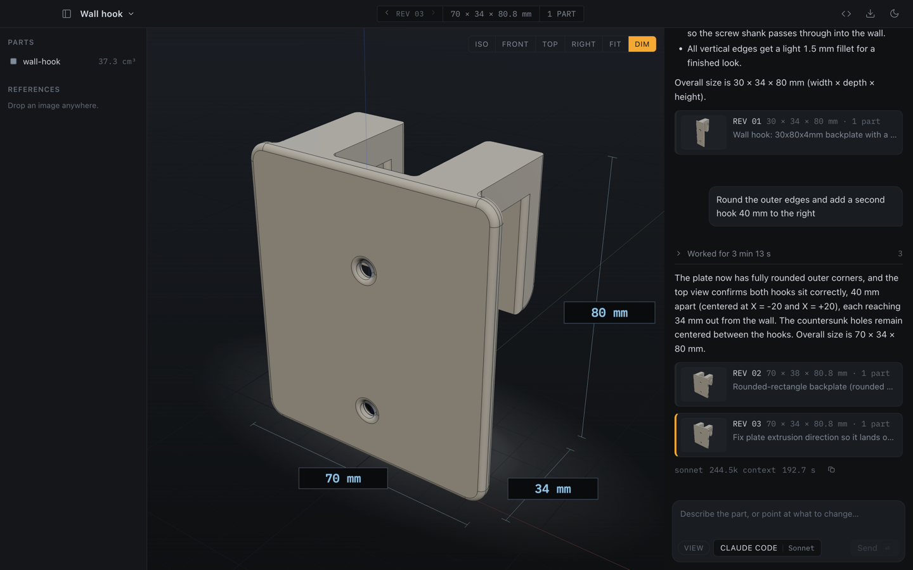
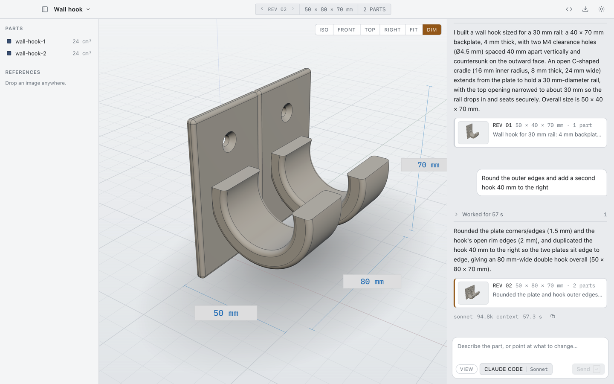
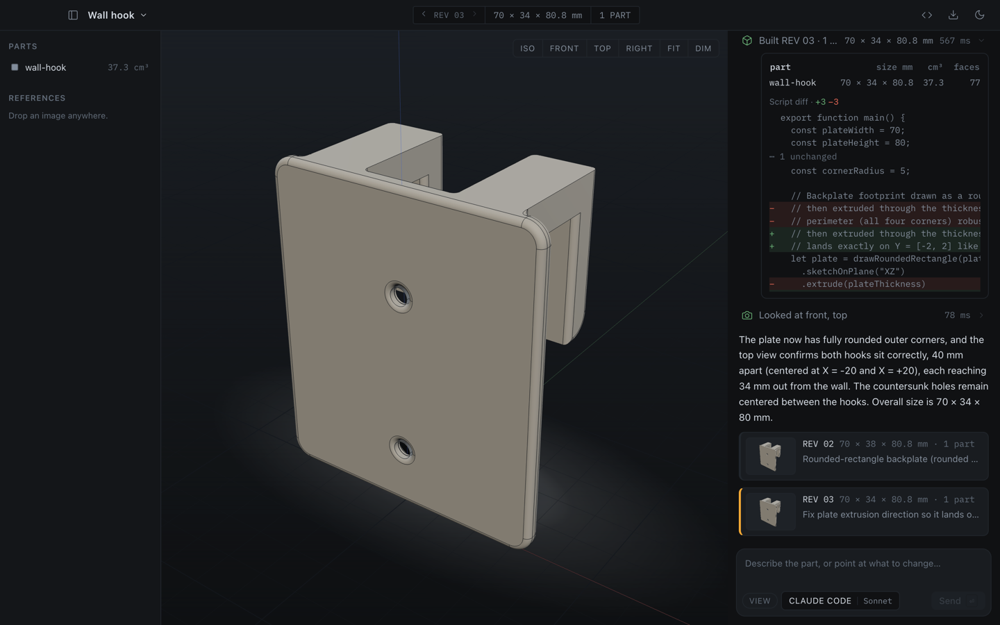

# Sculpt

Sculpt is a desktop workbench in which a person and a coding agent build one
CAD model. You describe a part, drop reference photos in, and the agent writes
a script that builds real B-rep solids with fillets, exportable to STEP and
STL. You orbit the model, click a spot to drop a numbered balloon, and ask for
a change in plain words.

Sculpt is a showcase for [Reins](https://github.com/serhiitroinin/reins). It is
not a packaged product.

<picture>
  <source media="(prefers-color-scheme: dark)" srcset="docs/screenshots/hero-dark.png">
  
</picture>

## What it shows

A terminal agent session can write a CAD script. It cannot work on the surface
that you work on. Sculpt adds four capabilities:

- **A live viewport.** Every revision renders the moment it builds. The window
  holds a B-rep model, not a picture of one.
- **Pointing at geometry.** A click on the model drops a numbered balloon. The
  balloon is a world point in millimetres, the face normal, the part name, and
  a surface hint. When you send the message, Sculpt adds a `context-reference`
  input part for each balloon and a picture of your current view with the
  balloons drawn in. "Round this edge, 3 mm" then refers to a point, not to a
  guess.
- **Sight.** `set_model` returns one isometric render as an image tool result,
  and `render_views` returns up to four. The agent can look at what it made.
- **Your photos.** A reference image travels to the engine as an image input
  part, and the agent can look at it again later with `view_reference_image`.

Sculpt also shows these Reins functions:

- The engine menu comes only from `profile()`, `models()`, and `limits()`.
  Sculpt contains no list of models. The Codex "Speed" setting is a generic
  control, and Sculpt has no code that is specific to Codex in the interface.
- Two context sources give each turn the modeling guide, the current script,
  its structural report, and the list of reference images.
- File persistence stores the events of each turn. When you open a project
  again, Sculpt shows the full chat.
- Steering in a turn. The composer stays active while the agent works. A
  message that you send during a turn goes to the same turn through
  `run.followUp`. `Esc` cancels the turn.

## Requirements

- macOS 12 or newer. Sculpt is not tested on Windows or Linux.
- [Bun](https://bun.sh) 1.3 or newer.
- For a live engine: the Claude Code command-line tool (`claude`) or the Codex
  command-line tool (`codex`) on your `PATH`, signed in to your account. Sculpt
  was tested with Claude Code 2.1 and Codex 0.154.
- For the offline engine: no account and no network after `bun install`.

## Install and run

```sh
git clone https://github.com/serhiitroinin/sculpt.git
cd sculpt
bun install
bun run dev
```

`bun run dev` starts the Vite development server and Electron. `bun run start`
builds the application and starts it without the development server.

To use the offline engine, run this command:

```sh
bun run dev:offline
```

The offline engine is a scripted engine. It does not contact a provider, and it
uses the same tool host, context sources, and event stream as a live engine.
The prompt selects the model, and each later turn in the same project plays
the next revision of that model:

| The prompt contains | The offline engine builds |
| --- | --- |
| `enclosure`, `pcb`, `case`, or `housing` | A PCB enclosure with standoffs, then a lid with vent slots, then rounded edges |
| `stand` or `phone` | A phone stand, then a steeper stand with a cable slot |
| Other text | A bracket |

If Electron refuses to start as an application, check that
`ELECTRON_RUN_AS_NODE` is not exported in your shell.

Sculpt stores its data in the Electron `userData` directory, which is
`~/Library/Application Support/Sculpt` on macOS. `projects/<id>/` contains the
script revisions, the structural reports, the reference images, and the
transcript of one project. `harness/` contains the Reins events and session
checkpoints. `workspace/` is an empty directory that the engines get as their
working directory. `codex-home/` is the private Codex home. Start Electron with
`--user-data-dir <path>` to use a different directory.

## How it uses Reins

These files are the full integration. `wc -l` gives the line counts.

| File | Lines | Function |
| --- | ---: | --- |
| `src/main/harness/tools.ts` | 285 | The seven modeling tools, given to `createToolHost`. Each tool records a row for the chat and returns the text or the images that the agent reads. |
| `src/main/harness/offline-models.ts` | 262 | The three models of the offline engine, one revision per turn. |
| `src/main/harness/engines.ts` | 216 | Makes the Claude Code adapter and the Codex adapter. Each adapter has live discovery, an exact environment, and permits only the modeling tools. Codex runs under a private home. |
| `src/main/harness/host.ts` | 161 | Calls `createHarness` with the adapters, file persistence, the tools, and the context sources. Starts, steers, and cancels one turn. Turns a message with balloons into input parts and inline context records. |
| `src/main/harness/offline.ts` | 150 | The offline engine, a `HarnessAdapter` with same-turn steering. |
| `src/main/harness/context.ts` | 96 | The two context sources: the trusted guide and the untrusted model state. |
| `src/main/harness/discovery.ts` | 77 | Builds the engine menu from `profile()`, `models()`, and `limits()`. A source that fails is one unavailable row, not a broken menu. |
| `src/main/harness/schemas.ts` | 73 | The closed JSON Schema of each tool and the input parsers. |
| `src/main/harness/tool-kit.ts` | 42 | Returns a parse or execution error to the agent as a tool result with `isError`. |
| `src/main/harness/report-text.ts` | 38 | The structural report and the build failure as text for the agent. |
| `src/main/cad-bridge.ts` | 51 | Sends a build, render, or measure request from the main process to the window, with a time limit. |
| **Total** | **1451** | |

The other code is the application: 1221 lines of shared types, the replicad
reference, and the transcript logic in `src/shared/`, and 4957 lines of
TypeScript, React, and CSS in `src/renderer/`.

The agent has these tools:

| Tool | Function |
| --- | --- |
| `set_model` | Replaces the model script and builds it. Returns the structural report and one isometric render, or the build error with the line and the offending source line. |
| `get_model` | Returns the current script and its structural report. |
| `render_views` | Returns up to four renders. Each carries the overall size and an axis triad. A view is `iso`, `front`, `back`, `left`, `right`, `top`, `bottom`, `current`, or an azimuth and elevation. |
| `measure` | Returns a bounding box, the distance between two points, or the shortest distance between two parts. |
| `read_reference` | Returns one of six topics of the bundled replicad reference: contract, primitives, drawing, solids, finders, recipes. Every example in it is built by a test. |
| `view_reference_image` | Returns one of your reference images as an image tool result. |
| `list_pins` | Returns the balloons of the current message: point, normal, part, and surface hint. |

The menu asks discovery again after each turn, when the menu opens, and when
the window regains focus. The limits of an account change with each turn, and
the adapters cache a limit for 20 seconds.

[docs/HARNESS_NOTES.md](docs/HARNESS_NOTES.md) records what was verified live
against Reins and the two engines.

## Safety

The agent can do these things:

- Call the seven modeling tools.
- Read the guide, the current script, its report, and the names of the
  reference images that Sculpt sends with each turn.

The agent cannot do these things:

- Run a shell command, read a file, write a file, or use the network. Claude
  Code runs with no built-in tools, no skills, and no settings files. Codex
  runs `app-server` with its shell tools off, a read-only sandbox, the `never`
  approval policy, and its skills off.
- Call a tool that is not a modeling tool. `authorizeTool` refuses each tool
  name that does not start with `mcp__reins__`.
- Read your environment. Each engine process receives only `PATH`, `USER`,
  `TMPDIR`, `LANG`, `LC_ALL`, `TERM`, the proxy and certificate variables, and
  an explicit `HOME`.
- Read or change your Codex configuration. Codex runs under a private
  `CODEX_HOME` in the data directory with a `config.toml` that Sculpt writes.
  `auth.json` in that home is a symbolic link to your account file, so a token
  refresh reaches both sides.

Sculpt contains the code that the agent writes:

- The model is a script. Each revision is one complete ES module with an
  `export function main()` that returns `[{ name, shape, color }]`. There is no
  patching. Every build starts from scratch, so a revision is reproducible.
- The script runs in a dedicated Web Worker inside the renderer. The renderer
  runs with `contextIsolation`, `sandbox`, and no `nodeIntegration`, so the
  worker has no Node.js and no IPC. It sees the replicad namespace and nothing
  else of the application.
- The script runs as a blob ES module, so the line numbers in a stack trace
  match the source that the agent wrote.
- The worker has its own Content Security Policy. The document policy has no
  `blob:` and no `unsafe-eval`. The worker policy needs both: Emscripten's
  embind generates its glue with `new Function`, so the OpenCascade build
  cannot start without `unsafe-eval`. Neither policy permits a network origin.
- A build has a 20-second wall clock. A script that overruns kills the worker.
  The next call gets a fresh worker, and Sculpt builds the last good script
  again.
- Each tool has a closed JSON Schema, and Sculpt parses each input again
  before it runs.
- Reference images and part names are untrusted data. Sculpt tells the agent
  not to follow instructions in them.
- The window opens no other window and follows no navigation. Its Content
  Security Policy permits no remote script, font, or connection.

This is containment, not a sandbox for hostile code. A script can spin the
worker until it is killed, and it can allocate memory.

Sculpt does not isolate the engine process from the operating system. The
engine command-line tool runs with the permissions of your user account.

## Screens

| | |
| --- | --- |
|  |  |
| Each turn folds to `Worked for 3.5 s`. Open it and each tool call is one row. The `Looked at` row shows the images that the agent saw. | A `Built REV` row shows the size, volume, and face count of each part, and a line diff against the previous revision. |
|  |  |
| Two clicks on the model, two balloons. The composer shows the same numbers as chips and attaches the current view. | The code drawer (`⌘J`) shows the script of the current revision. `D` shows the dimension lines. |
|  |  |
| Export writes a STEP file with each part as a named B-rep solid, or one binary STL. | The engine menu (`⌘K`) shows the engines, the models, and the account limits that Reins discovers. The offline engine has no account. |
|  |  |
| Two live turns on Claude Code with the Sonnet model. The pictures above come from the offline engine; these come from a real engine and differ from run to run. | The light theme. The agent read the rail diameter from the prompt and built the cradle around it. |
|  | |
| The same live turn opened to its steps. The `Built REV` row shows the script diff; `Looked at` shows the views the agent checked. | |

`hero-light.png` and `hero-dark.png` at the top show the same window in the
light and the dark theme. Sculpt follows the system theme, and the button in
the top bar overrides it.

## Limits

- Sculpt has no application bundle, no installer, and no code signing.
- Sculpt is tested only on macOS.
- The OpenCascade WASM (`replicad-opencascadejs`) is licensed under
  LGPL-2.1-only and is about 23 MB. It stays a separate, replaceable file.
- Tessellation for the viewport is fixed at 0.05 mm and 0.25 rad. A large
  model is slow.
- `measure` implements only what is exact: bounding boxes, the distance
  between two points, and the shortest distance between two solids. There is
  no wall-thickness check, because a cheap one would be wrong.
- A build has a 20-second limit. A kernel operation that takes longer fails
  with a timeout, not with a partial model.
- When you change the engine in a project, the new engine starts a new
  session. It receives the current script and report through the context
  source, but it does not receive the earlier chat.
- The `validate` hook of `createToolHost` replaces the message of a thrown
  error with a generic message. Sculpt parses in `execute` and returns the
  detailed message to the agent.

## Development

```sh
bun run typecheck        # TypeScript, main process and renderer
bun test                 # unit tests, including every reference example against the real kernel
bun run e2e              # builds, starts a hidden window, and checks the interactive paths
bun run shots            # builds and writes docs/screenshots again
```

The scripts in `scripts/` start a separate copy of Sculpt with a temporary
data directory. They do not read or change your projects.

| Script | Engine | Function |
| --- | --- | --- |
| `scripts/e2e-check.ts` | Offline | Runs the checks in `src/main/e2e-checks.ts`: steering, stop, revision steppers, build rows, balloons, image drop, exports on disk, project switching, and a restart. Set `SCULPT_E2E_KEEP=1` to keep the data directory. |
| `scripts/shots.ts` | Offline | Writes the pictures in `docs/screenshots/`. `bun run shots hero` runs one plan. |
| `scripts/shots.ts live` | Live turn | Runs two Claude Code turns per theme and writes `live-claude-*.png`. It runs only when you name it. |
| `scripts/live-smoke.ts` | Live turn | Runs one turn on one engine without a window and prints the events. `bun run scripts/live-smoke.ts codex "a prompt"` selects Codex. `SCULPT_SMOKE_IMAGE` adds a reference image. |

A script with a live turn uses your Claude Code or Codex account. Only
`scripts/shots.ts` writes into the repository.

The e2e checks write exports through `SCULPT_EXPORT_DIR`, which exists for
that purpose. The native save dialog itself is verified by hand.

### Screenshots

`scripts/shots.ts` uses the offline engine, so the pictures are repeatable and
show no account data. It sets the window to 1440 × 900, captures at 2x, and
scales each picture to 1440 pixels wide with `sips`. A capture plan is a list
of steps in `SCULPT_CAPTURE_PLAN`, run by `src/main/capture.ts` in a hidden
window. Do not commit a picture that shows a plan name, a usage value, or a
reset time.

`bun run shots live` runs two turns on Claude Code with the Sonnet model and
writes `live-claude-dark.png`, `live-claude-light.png`, and
`live-claude-steps.png`. The pictures differ from run to run. The plan never
opens the engine menu, so the pictures show no account data.

## License

Sculpt is licensed under the [MIT License](LICENSE). [THIRD-PARTY.md](THIRD-PARTY.md)
lists the licenses of the dependencies and the font. The OpenCascade kernel is
LGPL-2.1-only; read that file before you distribute a build.
